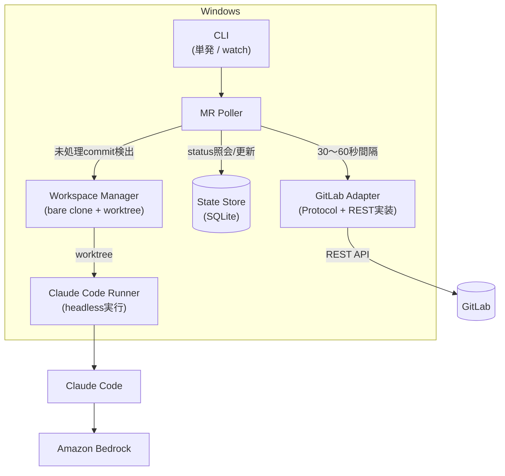
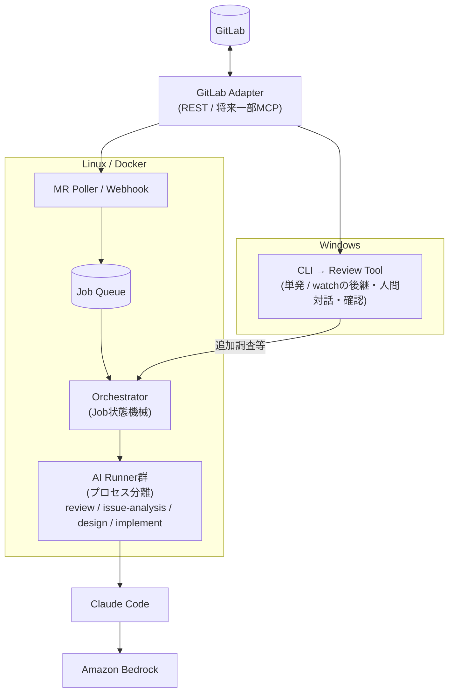

# アーキテクチャ

- 対応Issue: [#7](https://github.com/AtsushiNi/gitlab-ai-platform/issues/7) (D-3)
- 前提となる要件: [requirements.md](requirements.md)(未着手・D-2。当面は
  `references/AIとやりとりした履歴.md` を一次資料とする)

## 設計方針

> 最初から巨大なAI開発プラットフォームを作らない。今必要な**MRレビュー自動化**を作る。
> ただし各部品(GitLab Adapter / Workspace / Runner / Store / Job)は、将来の
> Issue→設計→実装→MRへそのまま成長できる境界で切る。

この一文がこのプロジェクトの設計上の唯一の判断基準になる。以降の全体図・コンポーネント分割・
データフローは、すべて「MVPとして単体で動くこと」と「後から作り直さずにJob層を差し込めること」
の両方を満たすように決めている。

## 全体図

### MVP(M1): レビュー自動化



レビュー結果は `reviews/<project>/<mr_iid>/<sha>/` にJSON+Markdownで保存され、人間がVS Code
(GitLab拡張)で確認する。GitLabへの自動コメント投稿はしない(MVPのスコープ外。M2-5で要否を再判断)。

### 将来像(M3以降): AI Platform



## コンポーネントの責務と境界

`src/gitlab_ai_platform/` 配下のモジュール境界は [ADR-0001](adr/0001-repository-structure.md)
で確定済み。各コンポーネントの責務は以下の通り。

| コンポーネント | 実装場所 | 責務 | 境界(やらないこと) | 対応Issue |
|---|---|---|---|---|
| GitLab Adapter | `gitlab_adapter/` | GitLabとのやりとりを一手に引き受ける唯一の窓口。read/write操作をProtocol/ABCで抽象化し、REST実装を差し替え可能にする(将来のMCP実装を同じ口に嵌める前提)。書き込みは許可リスト方式(read/branch作成/push/MR作成/コメントのみ)で、merge・protected branchへの直push・branch削除・管理操作を機構として禁止する | プロンプトの約束事だけに頼った制限はしない。GitLab以外の外部システムは扱わない | M1-1, M1-2, M1-3 |
| State Store | `store/` | `(project, mr_iid, commit_sha)` 単位でレビュー状態(`status` / `reviewed_at` / 結果パス)を記録し、二重レビューを防ぐ。リポジトリ層を抽象化しSQLite/PostgreSQL両対応にする | ビジネスロジック(レビューするか否かの判断)は持たない。単なる状態の記録・照会 | M1-4 |
| MR Poller | `poller/` | 30〜60秒間隔で対象プロジェクトを走査し、`レビュー待ち` ラベルのMRを抽出、State Storeと突き合わせて未処理commitを検出、レビューを起票する | Webhookは当面採用しない(MVP時点)。GitLabへの書き込みはしない | M1-5 |
| Workspace Manager | `workspace/` | プロジェクトごとのbare clone、MR単位のworktree作成/更新/破棄、ディスク上限とGCを管理する。並列レビューでworking treeを共有しない | git操作以外(ビルド・テスト実行など)はしない | M1-6 |
| Claude Code Runner | `runner/` | worktree上でClaude Codeをヘッドレス実行し、MRタイトル・説明・コメント・diffをコンテキストとして渡す。タイムアウト・異常終了のハンドリング、実行ログ保存を行う | レビュー観点の判断そのもの(何を重大とするか)はプロンプト側の責務であり、Runnerは実行制御のみ | M1-7 |
| Review | `review/` | レビュープロンプトの設計(`docs/specs/prompts.md`)と、結果スキーマ(重要度/ファイル/行/根拠/提案)の定義。JSON(機械可読)とMarkdown(人間可読)の両方を出力する | GitLabへの自動投稿はしない。最終判断は人間 | M1-8, M1-9 |
| CLI | `cli/` | 単発レビュー実行(デバッグ・プロンプト改善用)と、常駐(watch)モードの入り口。graceful shutdown・多重起動防止 | オーケストレーション(Job間の遷移)はしない。M4以降もCLIは「人間が操作する入口」の役割に留める | M1-10, M1-11 |
| config | `config/` | GitLab PAT・対象プロジェクト一覧・ポーリング間隔・並列数などの設定/シークレット管理。値のバリデーション、PATをログに出さない | (横断的関心事) | M0-2 |
| logging_ | `logging_/` | 構造化ログ、実行ID付与、ローテーション。可観測性の土台 | (横断的関心事) | M0-3 |

## Windows/Linuxの分担

環境制約(Windows・管理者権限なし・WSL/Docker Desktop不可・外部ダウンロード制限あり)が
出発点であり、「MVPだからWindows、将来はLinux」という時間軸の分担ではない。本質は
**人間が介在する処理はWindows、無人で回すAI処理はLinux/Docker** という処理性質による分担。

- **Windows**: MR Poller・Workspace Manager・Claude Code Runner・CLIをすべて人間の端末上で動かす。
  人間がVS CodeでMRを見ながら随時実行し、結果もその場で確認する運用のため、コンテナ分離や
  自動リトライの仕組みまでは不要
- **Linux/Docker**(M3以降): Issue駆動開発(M4)のような、人間が張り付かない無人実行が前提になる
  フェーズでは、失敗時の隔離・並列実行時のリソース制御・再現性のためにDocker上のRunnerが必要になる。
  WindowsにはDocker Desktopが無いため、この段階で初めてLinux/Dockerへ処理を移す

共通コード([ADR-0001](adr/0001-repository-structure.md)の`src/`レイアウト)は両環境で動くことを
制約として維持する。GitLab Adapter・Workspace Manager・Review pipelineのロジック自体は
Windows/Linuxで変わらず、実行環境(OS・コンテナの有無)だけが変わる。

## データフロー(MVP)

```text
1.  GitLab側で実装者がMRに `レビュー待ち` ラベルを付与
2.  MR Poller が GitLab Adapter 経由で対象プロジェクトを30〜60秒間隔で走査
3.  ラベル付きMRのうち、State Store に未記録 or 新しい commit_sha を検出
4.  Workspace Manager が該当MRのworktreeを作成(または既存を更新)
5.  Claude Code Runner が worktree上でヘッドレスClaude Codeを起動し、
    MRタイトル・説明・コメント・diffを渡す(Claude Code自身がリポジトリを探索する)
6.  Claude Code → Amazon Bedrock でモデル呼び出し
7.  Runner が応答を受け取り、Review モジュールがスキーマ(重要度/ファイル/行/根拠/提案)に
    整形し、JSON+Markdownを `reviews/<project>/<mr_iid>/<sha>/` に保存
8.  State Store の該当レコードを DONE に更新
9.  人間が VS Code(GitLab拡張)でMRの差分とレビュー結果を確認
10. 必要なら CLI から追加調査モード(M2-4、対話型Claude Code)で深掘り
11. 人間が本当に必要な指摘だけを GitLab に手動でコメント(AIによる自動投稿はしない)
12. 実装者が修正してpush → 新しい commit_sha → 手順3から再レビュー
```

## MVP → AI Platform への成長パス

**Job層はPoller(検出)とRunner(実行)の間に挿入される。** 検出側・実行側それぞれのロジックは
ほぼそのまま残り、その間を仲介する層(Job Queue・状態機械・Orchestrator)が新設される、
という形で成長する。

| 部品 | MVPでの形 | AI Platformでの変化 | 変わらないもの |
|---|---|---|---|
| GitLab Adapter | REST実装のみ | 同じProtocolの上でMCP実装に差し替え可能になる(M1-1で抽象化済みなら追加実装のみ) | Protocolインターフェース・書き込み許可リストの機構 |
| Workspace Manager | Windows上でbare clone+worktree | Linux/Docker上でも同じ抽象で動く(M3-4) | bare clone + MR単位worktreeというモデルそのもの |
| Claude Code Runner | Poller/CLIから直接同期呼び出し | Jobとして扱われ(M3-1)、別プロセス/別ホストに分離される(M3-3) | worktree上でheadless実行し、コンテキストを渡すロジック本体 |
| Review pipeline | プロンプト・出力スキーマの唯一の用途 | Job種別の1つ(`review`)になる。`issue-analysis`/`design`/`implement`が並ぶ(M4) | プロンプト設計・出力スキーマ・保存レイアウト |
| State Store | SQLite | バックエンドがPostgreSQLに移行(M3-5)。リポジトリ層抽象化のおかげでAPIは不変 | `(project, mr_iid, commit_sha)` による一意制約という設計 |
| MR Poller | Runnerを直接起動 | 起票先がJob Queueへの投入に変わる。Webhookと共存可能になる(M3-6) | ラベル走査・未処理commit検出のロジック |
| CLI | 単発実行/watchの唯一の入口 | 人間が操作する入口として残る(オーケストレーション自体はCLIの責務にしない) | 単発デバッグ・watch常駐という2つのモード |

新規に追加されるレイヤー:

- **Job抽象・状態機械**(M3-1): `PENDING` `RUNNING` `WAITING_HUMAN` `DONE` `FAILED`。既存のレビュー
  処理をこの型に再構成し、Issue駆動開発(M4)の各フェーズ(要求分析/設計/実装)も同じ型で表現する
- **Job Queue**(M3-2): まずDBベース。取得の排他・可視性タイムアウト・リトライ・デッドレター
- **Orchestrator**(M3-7, M4-1〜M4-6, M4-9〜M4-10): フェーズ間の状態遷移、`WAITING_HUMAN`による停止判断、
  HTTP API/サーバ層による外部連携の口(M4-7の実装フェーズはRunner、M4-8のpush/MR作成はGitLab Adapterの担当)

## 設計原則(今後ADR化する判断)

以下は `references/AIとやりとりした履歴.md` に由来する設計上の決定だが、まだADRとして
記録されていない(担当Issue着手時に [ADR-0001](adr/0001-repository-structure.md) に続く形で
書く想定。[docs/README.md](README.md) の更新ルールに従う)。

- **GitLab Adapterのインターフェースをprotocol抽象にし、将来のMCP差し替えに備える**:
  現在の社内GitLabは公式MCPが使えるバージョンではなく `glab` も導入できないためREST APIのみで
  実装するが、実装をREST決め打ちにはしない(M1-1で正式化)
- **Webhookではなくポーリングを選ぶ**: 社内GitLab側の設定変更を避けたいこと、MVPとしての
  シンプルさを優先。将来M3-6でWebhookとの併用へ拡張可能な形にしておく(M1-5で正式化)
- **書き込み操作は許可リスト方式でAdapter層が機構として禁止する**: プロンプト上の約束事だけに
  依存しない。merge・protected branchへの直push・branch削除・管理操作は実行不能にする
  (M1-3, X-1で正式化)

## 関連ドキュメント

- [requirements.md](requirements.md) — 要件定義(D-2、未着手)
- [roadmap.md](roadmap.md) — マイルストーンとIssue対応表(D-11、未着手)
- [adr/0001-repository-structure.md](adr/0001-repository-structure.md) — リポジトリ構成と依存方針
- `references/タスク整理.md` — 全Issueの元ネタ(一次資料)
- `references/AIとやりとりした履歴.md` — 要件の背景となった会話ログ(一次資料)
